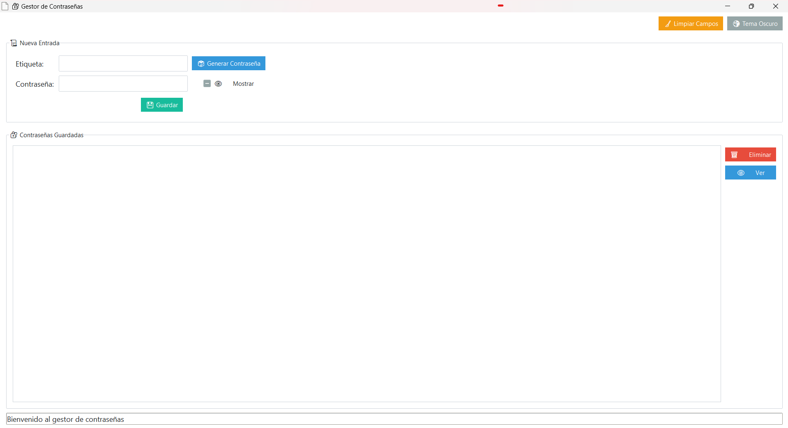
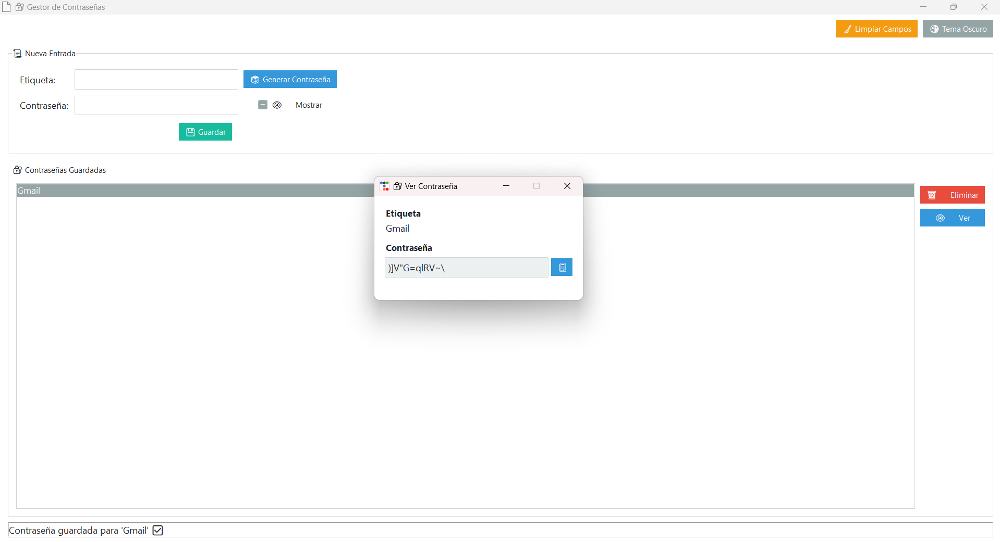

# 🔐 SaffePass - Gestor de Contraseñas Profesional

SaffePass es una aplicación de escritorio desarrollada en Python con interfaz moderna gracias a `ttkbootstrap`. Permite gestionar contraseñas de manera segura, visual y eficiente. Ideal para quienes buscan aprender o mostrar habilidades profesionales en interfaces gráficas con Python.

---

📅 Características

* ✅ Interfaz moderna inspirada en Bitwarden
* 🔐 Almacenamiento cifrado local (Fernet/AES)
* 🎲 Generador de contraseñas seguras
* 👁️ Visor profesional en ventana modal
* 📋 Copiar contraseña al portapapeles
* 🌚 Modo claro/oscuro
* 🧹 Botón para limpiar campos
* 📄 Exportable como `.exe` con icono personalizado
* 🔐 Inicio de sesión con Firebase

---

📊 Capturas

| Interfaz Principal              | Ventana Modal (Contraseña)        |
| ------------------------------- | --------------------------------- |
|  |  |

---

⚙️ Requisitos

* Python 3.10 o superior
* Windows 10/11 (para ejecutable `.exe`)

Instalar dependencias:

```bash
pip install -r requirements.txt
```

---

## 🔄 Ejecutar desde el código fuente

```bash
python src/main.py
```

---

💾 Ejecutable (.exe)

Puedes ejecutar directamente:

```
dist/SaffePass.exe
```

📥 Descargar ejecutable

[[Descargar .exe desde Google Drive](https://drive.google.com/file/d/1uZ7aAyytJftUmjK3hm3FtGKzpNUU45jx/view?usp=drive_link) / GitHub Releases]([https://github.com/AJJL2712/SaffePass/releases](https://github.com/AJJL2712/Saffe-Pass/releases/tag/v1.0.0))

> Reemplaza este enlace por el tuyo una vez subido el `.exe`

---

👤 Autor

**Alan Jahir**
Estudiante de Ingeniería en Sistemas de Información
[LinkedIn]([https://linkedin.com/in/alanjahir](https://www.linkedin.com/in/alan-jumbo-l%C3%B3pez-566a91213/)) 
[GitHub](https://github.com/AJJL2712)

---

📄 Licencia

Este proyecto está licenciado bajo los términos de la licencia MIT.

---

📘 Recursos

* `src/gui.py` - Interfaz principal con ttkbootstrap
* `src/password_manager.py` - Lógica de almacenamiento cifrado
* `src/encryption.py` - Módulo de cifrado Fernet (clave local)
* `src/password_generator.py` - Contraseñas aleatorias seguras

---

⚠️ Seguridad

Este repositorio no incluye:

- `firebase_config.json` (clave privada de Firebase)
- `data/key.key` (clave de cifrado local)
- `data/passwords.json` (contraseñas locales de ejemplo)

Asegúrate de generar tus propias claves al probar el proyecto localmente.

---

> Proyecto realizado como ejemplo profesional de app de escritorio en Python 🚀
